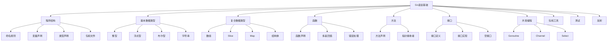

# Go语言学习流程图

```mermaid
graph TD
    A[Go语言基础] --> B[程序结构]
    A --> C[基本数据类型]
    A --> D[复合数据类型]
    A --> E[函数]
    A --> F[方法]
    A --> G[接口]
    
    B --> B1[命名规则]
    B --> B2[变量声明]
    B --> B3[类型声明]
    B --> B4[包和文件]
    
    C --> C1[整型]
    C --> C2[浮点型]
    C --> C3[布尔型]
    C --> C4[字符串]
    
    D --> D1[数组]
    D --> D2[Slice]
    D --> D3[Map]
    D --> D4[结构体]
    
    E --> E1[函数声明]
    E --> E2[多返回值]
    E --> E3[错误处理]
    
    F --> F1[方法声明]
    F --> F2[指针接收者]
    
    G --> G1[接口定义]
    G --> G2[接口实现]
    G --> G3[空接口]
    
    A --> H[并发编程]
    H --> H1[Goroutine]
    H --> H2[Channel]
    H --> H3[Select]
    
    A --> I[包和工具]
    A --> J[测试]
    A --> K[反射]
```

## 学习路径说明

1. **基础部分**：从程序结构、数据类型开始
2. **核心概念**：掌握函数、方法、接口
3. **高级特性**：学习并发编程
4. **工程实践**：了解包管理、测试和反射

> 注：此流程图基于标准Go语言学习路径和目录中的章节标题创建
