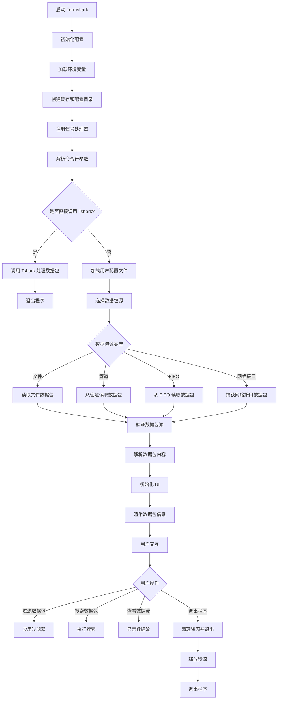

# Termshark 项目介绍

## 项目概述
Termshark 是一个基于 Go 语言开发的网络数据包分析工具，旨在为终端用户提供类似 Wireshark 的功能。它设计轻量化、易于使用，并能够在终端中高效运行，非常适合在无图形界面的环境中使用。

Termshark 的目标是为用户提供一个强大的工具，用于捕获、解析和分析网络数据包，同时保持简单易用的终端界面。它可能支持多种协议解析，并提供丰富的过滤和显示选项。

---

## 项目结构
Termshark 项目采用模块化设计，结构清晰，以下是主要目录及其功能的详细说明：

### 根目录
- **README.md**: 项目介绍文档，包含安装和使用说明。
- **LICENSE**: 项目的开源协议，定义了项目的使用和分发规则。
- **CHANGELOG.md**: 项目更新历史记录，详细列出了每次版本更新的内容。
- **go.mod 和 go.sum**: Go 的依赖管理文件，定义了项目的依赖库及其版本。

---

### `assets/`
- **主题配置文件**: 包含多个 `.toml` 文件（如 `default-16.toml` 和 `dracula-256.toml`），用于自定义 UI 的外观。
- **`statik/`**: 静态资源存储目录，可能包含预编译的资源文件，用于优化加载速度。

---

### `cmd/termshark/`
- **`termshark.go`**: 主程序入口文件，负责初始化应用、加载配置和启动核心功能。

---

### `configs/`
- **加密配置文件**: 如 `termshark-dd01307f2423.json.enc`，可能存储敏感信息。
- **`profiles/`**: 包含配置相关代码，支持用户配置的加载和管理。

---

### `docs/`
- **用户指南**: `UserGuide.md` 提供详细的使用说明。
- **FAQ**: `FAQ.md` 解答常见问题。
- **维护文档**: `Maintainer.md` 记录项目维护的相关信息。
- **打包文档**: `Packages.md` 说明如何打包和分发项目。

---

### `pkg/`
Termshark 的核心功能模块，包含以下子目录：
- **`pcap/`**: 
  - 处理数据包捕获和解析。
  - 包含 `cmds_unix.go` 和 `cmds_windows.go`，支持跨平台的命令处理。
  - `loader.go` 是数据包加载的核心实现。
- **`streams/`**: 
  - 处理数据流的跟踪和加载。
  - 提供流解析功能（如 `follow.go` 和 `parse.go`）。
- **`summary/`**: 
  - 生成数据包摘要，帮助用户快速了解数据包内容。
- **`fields/`**: 
  - 解析和处理数据包字段。
  - 包含测试文件 `fields_test.go`，确保字段解析的准确性。
- **`pdmltree/`**: 
  - 解析 PDML 数据结构，支持树状显示。
- **`shark/`**: 
  - 包含 Wireshark 配置相关代码。
- **`system/`**: 
  - 平台相关代码（如 `dumpcapext_darwin.go` 和 `dumpcapext_windows.go`），支持不同操作系统的扩展功能。

---

### `ui/`
用户界面相关代码，负责终端 UI 的渲染和交互。主要文件包括：
- **`capinfoui.go`**: 数据包信息显示界面。
- **`menu.go`**: 菜单渲染和交互逻辑。
- **`searchpktlist.go`**: 数据包列表的搜索功能。
- **`streamui.go`**: 数据流的显示界面。

---

### `widgets/`
包含各种 UI 组件，用于构建复杂的终端界面：
- **`hexdumper/`**: 十六进制数据包显示组件。
- **`scrollabletable/`**: 可滚动表格组件。
- **`search/`**: 搜索相关组件。
- **`wormhole/`**: 数据传输相关组件。

---

### `scripts/`
- **`do-release.sh`**: 项目发布脚本，自动化处理版本发布。
- **`simple-tests.sh`**: 测试脚本，用于快速验证项目功能。

---

## 技术特点
1. **语言与框架**
   - 使用 Go 语言开发，具有高性能和易于部署的特点。
   - 项目可能使用了 Go 的第三方库来处理数据包解析和终端 UI。

2. **模块化设计**
   - 项目分为多个子模块（如 `pkg/` 和 `ui/`），每个模块专注于特定功能，便于维护和扩展。

3. **终端友好**
   - 专注于终端用户体验，可能使用了 TUI（Terminal User Interface）相关技术。

4. **跨平台支持**
   - 从文件命名（如 `cmds_unix.go` 和 `cmds_windows.go`）可以看出，项目支持多个平台。

---

## 使用场景
Termshark 适用于以下场景：
- **网络工程师**: 快速分析数据包，无需图形化工具。
- **系统管理员**: 在服务器环境中进行网络故障排查。
- **开发者**: 调试网络协议或数据流。

---

## 研究总结
Termshark 是一个功能强大的终端网络分析工具，结合了 Go 的高性能和模块化设计。它的轻量化和终端友好特性使其成为 Wireshark 的优秀替代品，尤其适合在服务器或无图形界面的环境中使用。

如果需要进一步研究，可以深入分析以下文件：
- **`cmd/termshark/termshark.go`**: 主程序入口。
- **`pkg/pcap/loader.go`**: 数据包捕获和解析的核心实现。
- **`ui/streamui.go`**: 数据流显示的核心代码。

---

希望这份文档能帮助你全面介绍 Termshark 项目！

