以下是 Termshark 项目的模块分析，基于项目结构和文件内容：

---

### 1. **主程序模块**
- **文件**: termshark.go
- **功能**:
  - 程序的入口点，负责初始化配置、解析命令行参数、选择数据包源并启动 UI。
  - 调用核心功能模块（如 `pcap`、ui）以实现数据包捕获和解析。
  - 处理信号和退出逻辑。

---

### 2. **数据包捕获与解析模块**
- **目录**: pcap
- **功能**:
  - 负责数据包的捕获、解析和加载。
  - 支持多种数据包源，包括文件、管道、FIFO 和网络接口。
  - 提供工具函数（如 `cmds.go` 和 `loader.go`）以处理数据包的加载和解析。

---

### 3. **数据流处理模块**
- **目录**: streams
- **功能**:
  - 处理网络数据流的跟踪和加载。
  - 提供流解析功能（如 `follow.go` 和 `parse.go`）。
  - 支持数据流的实时分析。

---

### 4. **数据包字段解析模块**
- **目录**: fields
- **功能**:
  - 解析数据包中的字段信息。
  - 提供字段的测试和验证功能（如 `fields_test.go`）。

---

### 5. **数据包摘要模块**
- **目录**: summary
- **功能**:
  - 生成数据包的摘要信息。
  - 帮助用户快速了解数据包内容。

---

### 6. **用户界面模块**
- **目录**: ui
- **功能**:
  - 负责终端 UI 的渲染和交互。
  - 提供多种视图（如十六进制视图、摘要视图）。
  - 支持用户操作（如过滤、搜索）。

---

### 7. **UI 组件模块**
- **目录**: widgets
- **功能**:
  - 提供各种 UI 组件（如 `hexdumper/` 和 `scrollabletable/`）。
  - 用于构建复杂的终端界面。

---

### 8. **配置管理模块**
- **目录**: configs
- **功能**:
  - 管理用户配置文件和缓存。
  - 提供配置的加载和保存功能。

---

### 9. **脚本与工具模块**
- **目录**: scripts
- **功能**:
  - 包含项目发布和测试脚本（如 `do-release.sh`）。
  - 提供自动化工具以简化开发和维护。

---

### 10. **静态资源模块**
- **目录**: assets
- **功能**:
  - 存储主题配置文件（如 `default-16.toml`）。
  - 提供静态资源以支持 UI 的渲染。

---

### 11. **文档模块**
- **目录**: docs
- **功能**:
  - 提供用户指南（如 `UserGuide.md`）和 FAQ。
  - 记录项目维护和打包信息。

---

### 总结
Termshark 项目采用模块化设计，每个模块专注于特定功能，便于维护和扩展。核心模块包括数据包捕获与解析、用户界面和配置管理，支持跨平台运行和终端友好操作。如果需要更深入的分析，可以选择特定模块进行代码解读。

以下是更详细的 Termshark 项目类图，用 PlantUML 格式表示，涵盖了更多细节和方法：

```plantuml
@startuml
skinparam classAttributeIconSize 0

' 主程序模块
class Termshark {
    + main()
    + cmain()
    + InitializeConfig()
    + ParseCommandLineArgs()
    + SelectPacketSource()
    + StartUI()
    + HandleSignals()
    + CleanupResources()
}

' 数据包捕获与解析模块
package pcap {
    class IPacketSource {
        + Name(): string
        + IsFile(): bool
        + IsInterface(): bool
        + IsFifo(): bool
        + IsPipe(): bool
        + OpenSource(): bool
    }

    class FileSource {
        + Filename: string
        + OpenFile(): bool
        + ValidateFile(): bool
    }

    class InterfaceSource {
        + Iface: string
        + StartCapture(): bool
        + StopCapture(): bool
    }

    class FifoSource {
        + Filename: string
        + OpenFifo(): bool
        + ValidateFifo(): bool
    }

    class PipeSource {
        + Descriptor: string
        + Fd: int
        + OpenPipe(): bool
        + ValidatePipe(): bool
    }

    class PacketLoader {
        + LoadPackets()
        + ParsePackets()
        + FilterPackets(filter: string): bool
        + GetPacketSummary(): string
    }

    IPacketSource <|-- FileSource
    IPacketSource <|-- InterfaceSource
    IPacketSource <|-- FifoSource
    IPacketSource <|-- PipeSource
    PacketLoader --> IPacketSource
}

' 数据流处理模块
package streams {
    class StreamLoader {
        + LoadStream()
        + ParseStream()
        + TrackStream()
        + GetStreamSummary(): string
    }

    class StreamParser {
        + ParseTCPStream()
        + ParseUDPStream()
        + ExtractStreamData(): string
    }

    StreamLoader --> StreamParser
}

' 数据包字段解析模块
package fields {
    class FieldParser {
        + ParseField()
        + ValidateField()
        + ExtractFieldData()
        + GetFieldSummary(): string
    }

    class FieldValidator {
        + ValidateFieldFormat()
        + CheckFieldConsistency()
        + IsFieldValid(): bool
    }

    FieldParser --> FieldValidator
}

' 数据包摘要模块
package summary {
    class SummaryGenerator {
        + GenerateSummary()
        + FormatSummary()
        + GetSummaryDetails(): string
    }
}

' 用户界面模块
package ui {
    class UI {
        + Render()
        + HandleUserInput()
        + UpdateView()
        + DisplayError(message: string)
        + DisplayHelp()
    }

    class Menu {
        + DisplayMenu()
        + HandleMenuSelection()
        + UpdateMenuOptions()
        + GetSelectedOption(): string
    }

    class StreamUI {
        + DisplayStream()
        + UpdateStreamView()
        + HighlightStreamSection(section: string)
    }

    class HexView {
        + RenderHexData()
        + HighlightHexSections()
        + ScrollHexView(direction: string)
    }

    UI <|-- Menu
    UI <|-- StreamUI
    UI <|-- HexView
}

' UI 组件模块
package widgets {
    class HexDumper {
        + DisplayHex()
        + ScrollHexView()
        + HighlightHexData()
    }

    class ScrollableTable {
        + RenderTable()
        + Scroll()
        + UpdateTableData()
        + HighlightRow(row: int)
    }

    class SearchWidget {
        + ExecuteSearch(query: string)
        + HighlightSearchResults()
        + GetSearchSummary(): string
    }

    HexDumper --> ScrollableTable
    SearchWidget --> ScrollableTable
}

' 配置管理模块
package configs {
    class Profiles {
        + LoadProfile(profileName: string)
        + SaveProfile(profileName: string)
        + SwitchProfile(profileName: string)
        + GetCurrentProfile(): string
    }

    class ConfigManager {
        + LoadConfig(configFile: string)
        + SaveConfig(configFile: string)
        + ValidateConfig(configFile: string): bool
        + GetConfigDetails(): string
    }

    Profiles --> ConfigManager
}

' 关联关系
Termshark --> pcap.PacketLoader
Termshark --> streams.StreamLoader
Termshark --> fields.FieldParser
Termshark --> summary.SummaryGenerator
Termshark --> ui.UI
Termshark --> configs.Profiles
@enduml
```

### 类图详细说明
1. **主程序模块**
   - `Termshark` 类是项目的核心，负责协调各模块的工作。
   - 包含初始化配置、解析命令行参数、选择数据包源、启动 UI、处理信号和清理资源的方法。

2. **数据包捕获与解析模块**
   - `IPacketSource` 是数据包源的接口，支持文件、网络接口、FIFO 和管道等多种数据包源。
   - `PacketLoader` 提供数据包的加载、解析、过滤和摘要功能。

3. **数据流处理模块**
   - `StreamLoader` 负责加载和跟踪网络数据流。
   - `StreamParser` 提供具体的流解析功能（如 TCP 和 UDP）。

4. **数据包字段解析模块**
   - `FieldParser` 负责解析和提取数据包字段信息。
   - `FieldValidator` 验证字段的格式和一致性。

5. **数据包摘要模块**
   - `SummaryGenerator` 生成数据包的摘要信息，并格式化输出。

6. **用户界面模块**
   - UI 是用户界面的核心类，负责渲染和处理用户输入。
   - `Menu`、`StreamUI` 和 `HexView` 是 UI 的子模块，分别负责菜单、数据流和十六进制视图的显示。

7. **UI 组件模块**
   - 包含多个组件类，如 `HexDumper` 和 `ScrollableTable`，用于构建复杂的终端界面。
   - `SearchWidget` 提供搜索功能，并与表格组件交互。

8. **配置管理模块**
   - `Profiles` 类负责加载、保存和切换用户配置。
   - `ConfigManager` 提供配置的验证功能。

---

如果需要进一步扩展或调整类图，请告诉我！ 